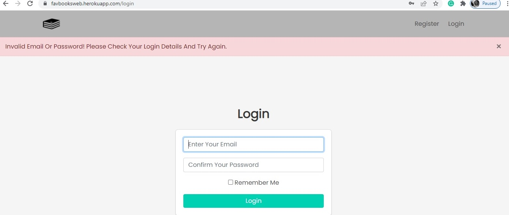

# FavBooks

A web application for buying books. It was built with Python, HTML, CSS, JavaScript, flask, and was hosted on Heroku.

`The Customer Part of the Web Application`

Users that are not admins can access the home page and payment page.

`The Admin Part of the Web Application`

Admins can update the books and the details of the books. They can also edit the news details.

`Authentication`

Basic authentication was added to the web application. During registration, A user must provide a unique email address and password. The password must match the confirmation password. 

